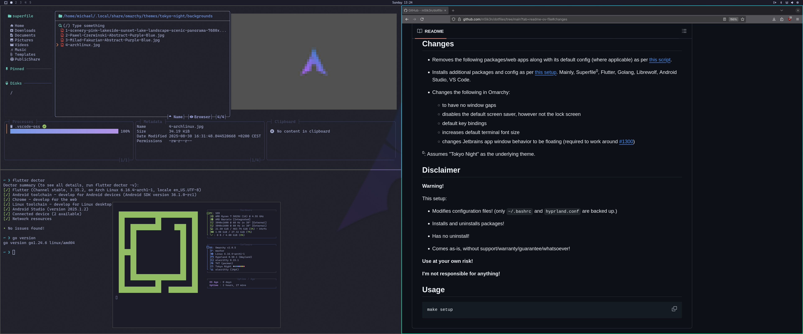

# dotfiles

My opinionated setup on top of the opinionated [Omarchy](https://omarchy.org/) (v3.2 at the time of writing (2025-11-22)).



## Changes

- Removes the packages/web apps along with its default config (where applicable) as per [this script](uninstall-defaults.sh).

- Installs additional packages and config as per [this script](./setup.sh).

- Changes the following in Omarchy:
  - to have no window gaps
  - disables the default screen saver, however not the lock screen
  - default key bindings
  - increases default terminal font size

## Disclaimer

**Warning!**

This setup:

- Modifies configuration files! (only `~/.bashrc` is backed up.)

- Installs and uninstalls packages!

- Changes could only be reverted manually!

- Comes as-is, without support/warranty/guarantee/whatsoever!

**Use at your own risk!**

**I take no responsibility!**

## Usage

```bash
make setup
```

## To do

- Automate Android Studio and Android SDK installation
- Automate Flutter installation