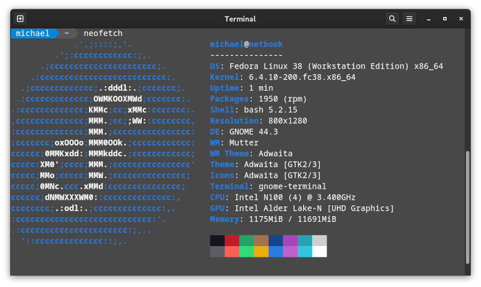

# Setup Fedora Workstation 38 on an N100 Netbook

In 08/2023 I installed [F38](https://download.fedoraproject.org/pub/fedora/linux/releases/38/Workstation/x86_64/iso/Fedora-Workstation-Live-x86_64-38-1.6.iso) from a USB stick to this [Mini Laptop](https://liliputing.com/this-350-mini-laptop-has-an-8-inch-touchscreen-display-and-an-intel-n100-alder-lake-n-processor/) with an N100 CPU.



Initially, there were a few challenges:
- Start-up: The Live version didn't boot properly, it got stuck in a black screen during the start-up process.
- Screen resolution: Only 800x600 was available in the Live version. As soon as Fedora was installed on the local disk, the higher resolution (1280x800 / 800x1280) became available.
- Screen rotation: Both, login screen and desktop weren't in landscape mode.
- WiFi: The WiFi functionality was absent in the beginning, but became available after updating Fedora, i.e., I started on a wired connection.
- Suspend: When suspended, the netbook didn't resume; I had to reboot.

Here are my steps to install Fedora:

## Boot

As a general remark, when the AMI logo appears, press DEL to enter the BIOS. Then choose the USB stick to boot from, save changes and boot.

### Boot menu

In order to start the Live version successfully, press `e` for the default boot option in the menu. Modify the boot option by replacing "quiet splash" with "nomodeset". 
Press `Ctrl+x` and wait for the (rotated) installation desktop to appear. 

(My [source](https://linuxmint-installation-guide.readthedocs.io/en/latest/boot_options.html) of inspiration.)

## Installation

With a twisted head :wink:, I ran the default installation.

After first start, I ran

```bash
sudo dnf update
sudo dnf upgrade
```

Also, the higher resolution became available and I changed the desktop rotation via:

Settings :arrow_right: Display :arrow_right: Rotate *left* (that direction seemed counter-intuitive to me, I expected *right*)

From that moment on, the desktop was in landscape mode.

[This](https://forums.fedoraforum.org/showthread.php?322546-How-to-rotate-Gnome-login-screen-to-vertical-position) explains how to rotate the login screen as well. 

Next, I went through [17 Things to Do After Installing Fedora 38](https://itsfoss.com/things-to-do-after-installing-fedora/) and picked what I needed. As far as "11. Screen Lock and Power Settings" goes, I chose "Screen Blank" after 10 minutes with "Automatic Suspend" set to "Off" (I've not managed to get the resume to work). ("12. Use Night Light Settings" was unavailable for me.)

Then, I added "Oh My Bash":

```bash
bash -c "$(curl -fsSL https://raw.githubusercontent.com/ohmybash/oh-my-bash/master/tools/install.sh)"
```

In `~/.bashrc`, I changed the theme to `powerline` (I didn't have to install a font) and completed this part of the installation with:

```bash
source .bashrc
```

Last, I installed Vim and Golang as per my [dotfiles](README.md) description.

## Key Bindings

- Out of the box,
  - `Fn+Win+Cursor up/down` changes the workspace
  - `Win+l` locks the screen (and blanks it)
- As per [this](https://docs.fedoraproject.org/en-US/quick-docs/proc_setting-key-shortcut/) description, I added
  - `Ctrl+Alt+t` to start a terminal
  - `Ctrl+Alt+b` to start Firefox

## Misc.

I've successfully set up 2FA for the GNOME environment thanks to [How to set up 2FA for user login](https://discussion.fedoraproject.org/t/how-to-set-up-2fa-for-user-login/82433/2) by copying the generated `~/.google_authenticator` under `/var/lib/google-authenticator`.
([Enabling 2FA on RHEL 8 using Google Authenticator](https://ins3cure.com/enabling-2fa-on-rhel8/) might also be a good (and still valid) source of inspiration.)
Now, I'm trying 2FA out...
