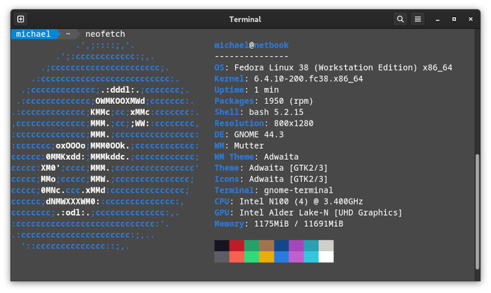

# Setup Fedora Workstation 38 on an N100 Netbook

In 08/2023 I installed [F38](https://download.fedoraproject.org/pub/fedora/linux/releases/38/Workstation/x86_64/iso/Fedora-Workstation-Live-x86_64-38-1.6.iso) from a USB stick to this [Mini Laptop](https://liliputing.com/this-350-mini-laptop-has-an-8-inch-touchscreen-display-and-an-intel-n100-alder-lake-n-processor/) with an N100 CPU. 



Initially, there were a few challenges:
- Start-up: The Live version didn't boot properly, it got stuck in a black screen during the start-up process.
- Screen resolution: Only 800x600 was available in the Live version. As soon as Fedora was installed on the local disk, the higher resolution (1280x800 / 800x1280) became available.
- Screen rotation: Both, login screen and desktop weren't in landscape mode.
- WiFi: The WiFi functionality was absent in the beginning, but became available after updating Fedora, i.e., I started on a wired connection.
- Suspend: When suspended, the netbook didn't resume; I had to reboot.

Here are my steps:

## Boot

When the AMI logo appears, press DEL to enter the BIOS. Then choose the USB stick to boot from, save changes and boot.

### Boot menu

In order to start the Live version successfully, press `e` for the default boot option. Modify the boot option by replacing "quiet splash" with "nomodeset". 
Press `Ctrl+x` and wait for the (rotated) desktop to appear. 

(My [source](https://linuxmint-installation-guide.readthedocs.io/en/latest/boot_options.html) of inspiration.)

## Installation

With a twisted head :wink:, I ran the default installation.

After first start, I ran

```bash
sudo dnf update
sudo dnf upgrade
```

Also, the higher resolution became available and I changed the desktop rotation via:

Settings :arrow_right: Display :arrow_right: Rotate *left* (that direction seemed counter-intuitive to me, I expected *right*)

From that moment on, the desktop was in landscape mode.

[This](https://forums.fedoraforum.org/showthread.php?322546-How-to-rotate-Gnome-login-screen-to-vertical-position) explains how to rotate the login screen as well. 

Next, I went through [17 Things to Do After Installing Fedora 38](https://itsfoss.com/things-to-do-after-installing-fedora/) and picked what I needed.

Then, I added "Oh My Bash":

```bash
bash -c "$(curl -fsSL https://raw.githubusercontent.com/ohmybash/oh-my-bash/master/tools/install.sh)"
```

In `~/.bashrc`, I changed the theme to `powerline` and completed this part of the installatio with:

```bash
source .bashrc
```

## Key Bindings

- Out of the box, `Fn+Win+Cursor up/down` changes the workspace
- As per [this](https://docs.fedoraproject.org/en-US/quick-docs/proc_setting-key-shortcut/) description, I added
  - `Ctrl+Alt+t` to start a terminal
  - `Ctrl+Alt+b` to start Firefox

## Outlook

I've successfully set up 2FA for the GNOME environment thanks to [How to set up 2FA for user login](https://discussion.fedoraproject.org/t/how-to-set-up-2fa-for-user-login/82433/2) by copying the generated `~/.google_authenticator` under `/var/lib/google-authenticator`.
([Enabling 2FA on RHEL 8 using Google Authenticator](https://ins3cure.com/enabling-2fa-on-rhel8/) might also be a good (and still valid) source of inspiration.)
Now, I'm trying 2FA out...
